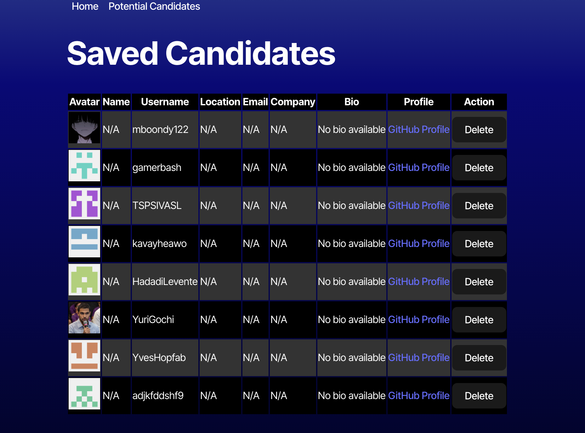

# Candidate Search

## Table of Contents
- [Description](#description)
- [Installation](#installation)
- [Usage](#usage)
- [Contributing](#contributing)
- [Questions](#questions)

## Description
A Github Candidate Search application that lets you see potential candidates for your company. You also have a saved candidates page where you can see all the candidates you have saved for later.

## Installation

Download the code to your local  machine. Run `npm install` to install all the dependencies. Run `npm start` to start the application.

## Usage

Deployed Site- https://candidate-search-paip.onrender.com

## Contributing

Submit a pull request to contribute to this project.

## Questions

Reach out to me at the following:

- GitHub: [lattecoding](https://github.com/lattecoding)
